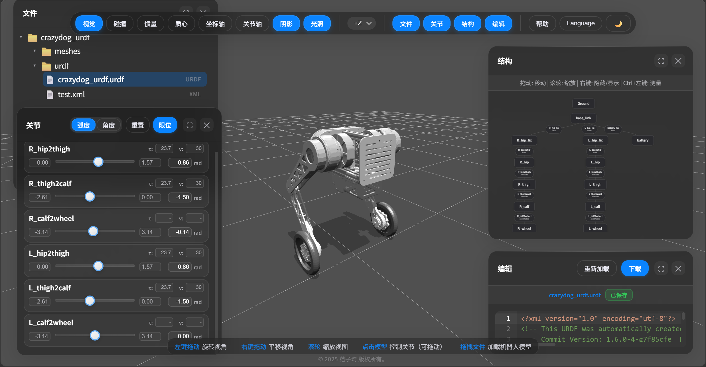
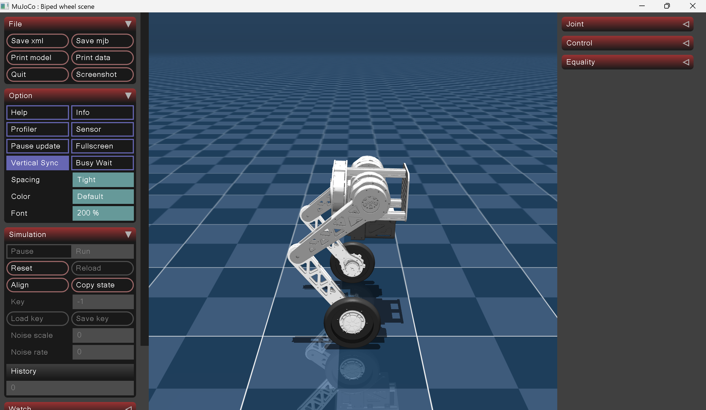
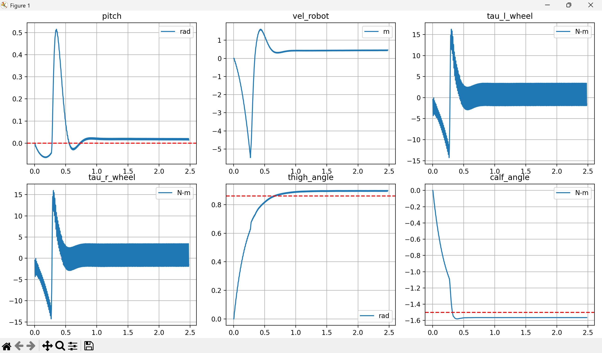

# wheel-bipedal-robot-control
controller using PID for thigh and calf link and LQR for wheel 

clone project
```bash
 git clone https://github.com/Jasonshih0415/wheel-bipedal-robot-control.git 
```
```bash
 cd wheel-bipedal-robot-control
```
install environment by conda
```bash
 conda env create -f environment.yml
```
```bash
 conda activate ntut_mujoco
```
static balance 
```bash
 python main.py static_balance=True
```
balance and move forward
```bash
 python main.py static_balance=False
```

### Tool

robot viewer


###  References
**Author:** Chen Ningzhan (google: 平衡步兵嵌入式技術文檔)  
**File:** [Dynamic model of biped wheel robot.pdf](./Dynamic%20model%20of%20biped%20wheel%20robot.pdf)

### Mujoco Result


